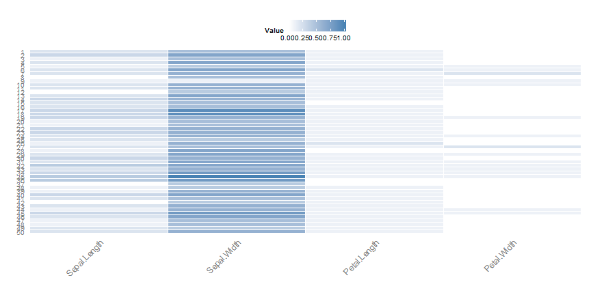

RDataViz
========================================================
author: 
date: 

RDataViz
========================================================

Question: 
  What's the best way to understand my data? 

Answer: 
  Interactively, of course! 

Overview
========================================================

Steps to run RDataViz:  
 - Save a dataset on your computer 
 - Go to https://wtcooper.shinyapps.io/RDataViz  
 - Click on "Choose File" button


Data Table and Summary
========================================================

After loading a file, the data will be presented as an interactive Data Table (Data Table tab) a summary will be provided on the opening tab (Choose File):


```
iris 

 5  Variables      150  Observations
---------------------------------------------------------------------------
Sepal.Length 
      n missing  unique    Info    Mean     .05     .10     .25     .50 
    150       0      35       1   5.843   4.600   4.800   5.100   5.800 
    .75     .90     .95 
  6.400   6.900   7.255 

lowest : 4.3 4.4 4.5 4.6 4.7, highest: 7.3 7.4 7.6 7.7 7.9 
---------------------------------------------------------------------------
Sepal.Width 
      n missing  unique    Info    Mean     .05     .10     .25     .50 
    150       0      23    0.99   3.057   2.345   2.500   2.800   3.000 
    .75     .90     .95 
  3.300   3.610   3.800 

lowest : 2.0 2.2 2.3 2.4 2.5, highest: 3.9 4.0 4.1 4.2 4.4 
---------------------------------------------------------------------------
Petal.Length 
      n missing  unique    Info    Mean     .05     .10     .25     .50 
    150       0      43       1   3.758    1.30    1.40    1.60    4.35 
    .75     .90     .95 
   5.10    5.80    6.10 

lowest : 1.0 1.1 1.2 1.3 1.4, highest: 6.3 6.4 6.6 6.7 6.9 
---------------------------------------------------------------------------
Petal.Width 
      n missing  unique    Info    Mean     .05     .10     .25     .50 
    150       0      22    0.99   1.199     0.2     0.2     0.3     1.3 
    .75     .90     .95 
    1.8     2.2     2.3 

lowest : 0.1 0.2 0.3 0.4 0.5, highest: 2.1 2.2 2.3 2.4 2.5 
---------------------------------------------------------------------------
Species 
      n missing  unique 
    150       0       3 

setosa (50, 33%), versicolor (50, 33%) 
virginica (50, 33%) 
---------------------------------------------------------------------------
```


Heatmap
========================================================

 - A heatmap representation of the data is provided (Heatmap tab) in order to visualize the relationships between columns.  Note: the data are scaled between 0-1: 

 


Distribution
========================================================

 - The raw distribution of the data are presented (Distribution tab):

 


vizrd
========================================================

Once can also install the related R package 'vizrd' to interactively launch an R data.frame:


```r
# install.packages('devtools')
library(devtools) 
devtools::install_github("wtcooper/vizrd") 
```
